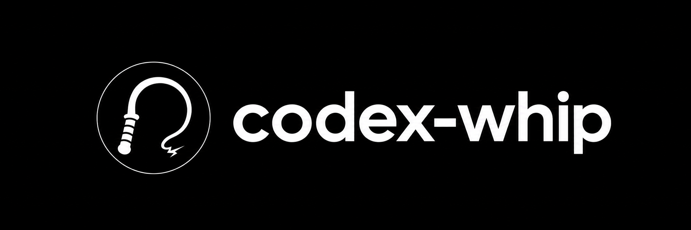

# Codex Whip



Codex Whip is a Windows utility inspired by
[OpenWhip](https://github.com/GitFrog1111/OpenWhip). It displays a whip over
Codex Desktop or Codex CLI and sends a short steering message when the whip
cracks. It runs in the notification area and does not modify Codex
configuration, environment variables, or session files.

Codex Whip is an independent community project. It is not affiliated with or
endorsed by OpenAI.

## Requirements

- Windows 10 or Windows 11.
- .NET 8 Desktop Runtime.
- Codex Desktop, or Codex CLI in Windows Terminal, classic PowerShell, or
  Command Prompt.
- For Codex Desktop: **Settings > General > Follow-up behavior > Steer**. With
  **Queue**, the message waits until the current task finishes.

## Install

[Download the latest Windows release](https://github.com/inerthel-agi/codex-whip/releases/latest),
or build from source:

```powershell
dotnet build -c Release
dotnet run -c Release
```

Publish a framework-dependent, single-file executable:

```powershell
dotnet publish -c Release -r win-x64 --self-contained false -p:PublishSingleFile=true
```

The executable is written to
`bin\Release\net8.0-windows\win-x64\publish\CodexWhip.exe`, with WAV files in
the adjacent `sounds` directory.

## Usage

1. Start a Codex task in Codex Desktop or Codex CLI.
2. Run `CodexWhip.exe`. The whip starts hidden.
3. Press `F8` to show the whip.
4. Move the pointer quickly in one direction and back to crack it. Movement
   speed selects one of four sound levels.
5. Press `F8` again to hide the whip.

The notification icon menu contains:

- **Whip Codex**: shows or hides the whip. A left-click on the icon does the same.
- **Auto steering**: attempts a steer every 60 seconds while Codex is already in
  the foreground. It is disabled at every startup.
- **Whip shortcut**: selects `F8`, `F9`, `F10`, or `Ctrl+Alt+W` for the current
  session. If another application owns a shortcut, the previous one is kept.
- **Quit**: releases the shortcut and closes the application.

Sending rules, safety guards, the steering log, and troubleshooting are
described in [docs/steering.md](docs/steering.md).

## Configuration

| Option                 | Effect                                                                                                    |
| ---------------------- | --------------------------------------------------------------------------------------------------------- |
| `--show`               | Starts with the whip visible.                                                                             |
| `--diagnose`           | Checks Codex Desktop and writes JSON. Returns `0` when ready, `2` otherwise.                              |
| `--diagnose --verbose` | Adds the Desktop composer area and the log file path to the JSON.                                         |
| `--diagnose-cli`       | Waits up to 12 seconds for a terminal in the foreground and reports the CLI guards. Sends nothing.        |
| `--self-test`          | Runs the deterministic self-tests. Returns `0` on success, `3` on failure.                                |

## Limitations

- The Desktop integration relies on Windows UI Automation and guarded keyboard
  input. A major Codex Desktop interface change may break composer detection.
- The Desktop `Steer` button label is only verified with the English Codex
  interface.
- The VS Code integrated terminal, Git Bash, and WSL are not supported.
  Windows Terminal split panes are refused.

## License

Codex Whip is available under the [MIT License](LICENSE). See
[CONTRIBUTING.md](CONTRIBUTING.md) to validate a change and
[SECURITY.md](SECURITY.md) to report a security issue.
